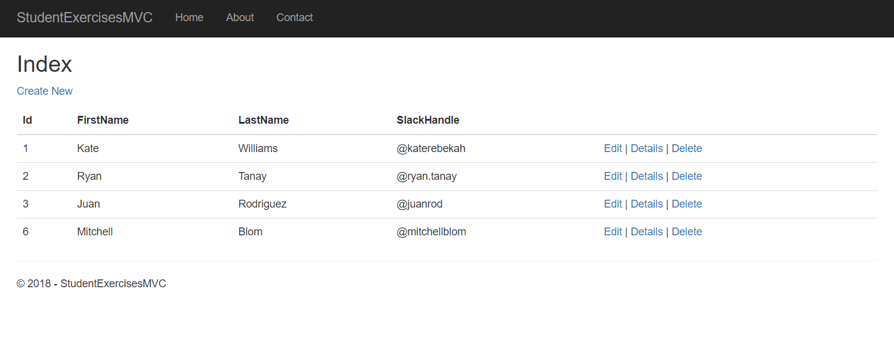
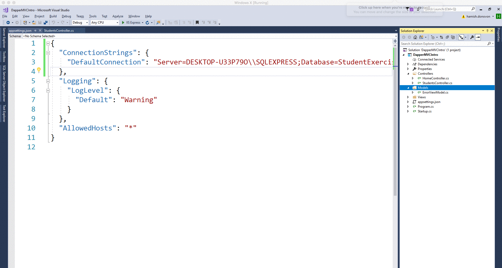
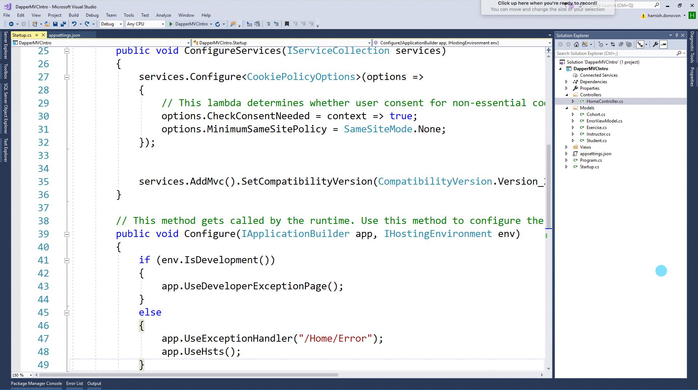
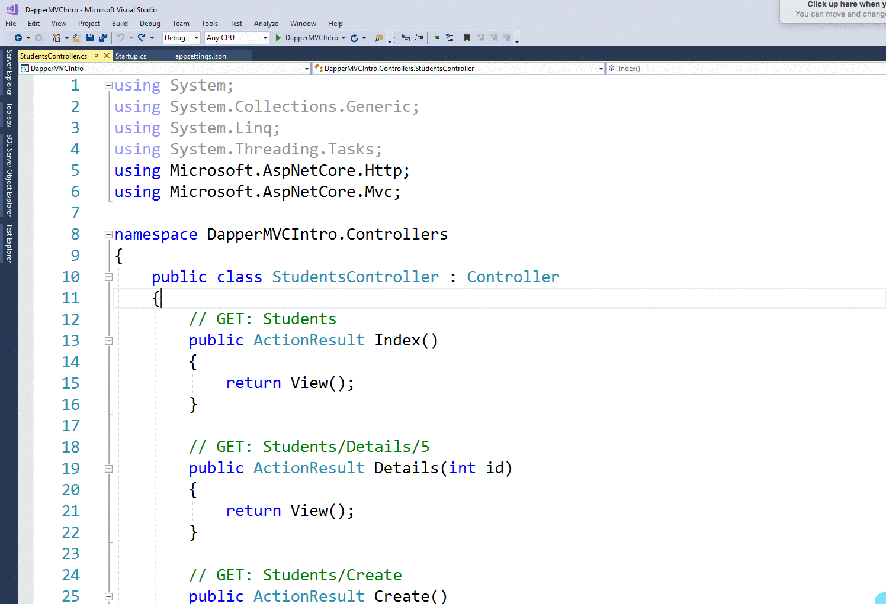

# Introduction to ASP.NET MVC Web Application

An MVC Web Application differs from your API in the fact that you are producing HTML instead of JSON. When a client requests `http://localhost:5000/students` in an API, they get a JSON representation of students in the response.

```json
[
    {
        "id": 1,
        "firstName": "Amy",
        "lastName": "Bennett",
        "slackHandle": "@amybennett",
        "cohortId": 2
    }
]
```

In a Web Application, you will be using the Razor templating system in .NET Core to produce an actual HTML page that will render a list of students in the browser.



## Getting Started

1. Create new project in Visual Studio
1. Choose the _ASP.NET Core Web Application_
1. Specify project name of _StudentExercisesMVC_
1. Click _Ok_
1. Choose _Web Application (Model-View-Controller)_
1. Click _Ok_

## Configuration

Open your `appsettings.json` file and add your connection string. If you copy the text below, make sure you change it to contain your server name.

```json
"ConnectionStrings": {
    "DefaultConnection": "Server=localhost\\SQLEXPRESS;Database=StudentExercises;Trusted_Connection=True;"
}
```

## Models

You are going to be using the same models that you used in your API project. You can copy pasta those files into your new project.




## Controller

Time to use Visual Studio scaffolding to create a base controller for our **`Student`** resource. Right click on the `Controllers` directory in Solution Explorer. Then choose `Add > New scaffolded item`.

In the window that appears, choose _MVC Controller with read/write actions_. Then click the _Add_ button. You will then be asked to name your controller, so name it `StudentsController`.

 Your controller will be automatically created for you and `StudentsController.cs` will appear in your Solution Explorer.



### Injecting Configuration for Connection String

Next, you can copy the controller constructor and `Connection` property from a previous project and rename the constructor to `StudentsController`. You can also copy it from below and paste it into your controller.

You'll have to use the helpful lightbulb several times to get all of the packages imported.

```cs
private readonly IConfiguration _config;

public StudentsController(IConfiguration config)
{
    _config = config;
}

public SqlConnection Connection
{
    get
    {
        return new SqlConnection(_config.GetConnectionString("DefaultConnection"));
    }
}
```



## Student List Method

Your `Index` method in a web application should return a list of the corresponding resource. Modify your method to contain the following code.

```cs
using (SqlConnection conn = Connection)
{
    conn.Open();
    using (SqlCommand cmd = conn.CreateCommand())
    {
        cmd.CommandText = @"
            SELECT s.Id,
                s.FirstName,
                s.LastName,
                s.SlackHandle,
                s.CohortId
            FROM Student s
        ";
        SqlDataReader reader = cmd.ExecuteReader();

        List<Student> students = new List<Student>();
        while (reader.Read())
        {
            Student student = new Student
            {
                Id = reader.GetInt32(reader.GetOrdinal("Id")),
                FirstName = reader.GetString(reader.GetOrdinal("FirstName")),
                LastName = reader.GetString(reader.GetOrdinal("LastName")),
                SlackHandle = reader.GetString(reader.GetOrdinal("SlackHandle")),
                CohortId = reader.GetInt32(reader.GetOrdinal("CohortId"))
            };

            students.Add(student);
        }

        reader.Close();

        return View(students);
    }
}
```

## Student List Razor Template

1. Right click on the `Index` method in your `StudentsController`
1. Choose `Add View..`
1. In the window that appears, provide a name of `Index`, template is `List`, and then choose the `Student` model
1. Click `Add` and wait for the Razor template to be generated

## Viewing the List of Students

Now you start the project. Visit [http://localhost:5000/students](http://localhost:5000/students) in your browser to see the HTML representation of students you have in your database.

## Adding the Other Views

The next step is to create the `Details` view, the `Edit` view, and the `Delete` view. Use the scaffolding for _MVC View_ to create the Razor templates for each one. Don't attempt to build the create view until you get to the next chapter about View Models.


